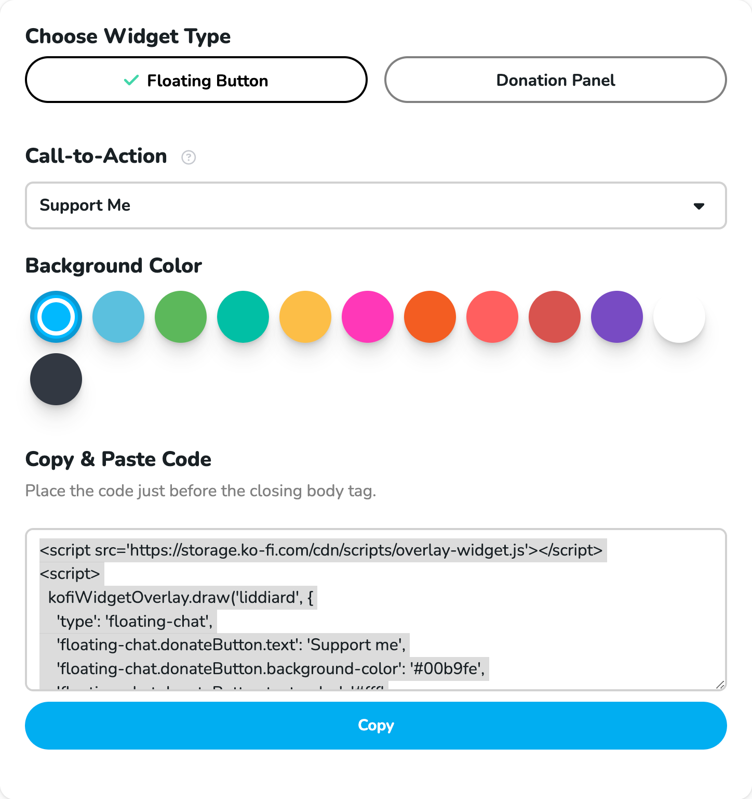

# Ko-fi overlay widget

[**Jump to usage**](#usage)

A React component for accepting donations though Ko-fi without leaving your website:


## Features

- Fully customize donate button style & content
- Accept donations in page context (no redirect)
- Customize donation panel size & placement
- Trigger a function when donation panel is open or closed

## Motivation

To set up what Ko-fi calls their "[Floating Button Donation Widget](https://ko-fi.com/Manage/donation-widget-setup)," they let you do some basic customization and ask you to copy and paste two `<script>` tags onto your site:



This has some limitations:

- It only allows you to choose from a handful of button calls-to-action, which may not meet your needs.
- It provides a limited selection of background color choices, which may not match your website theme.
- It requires you to load a `<script>` tag from their CDN, which creates a global variable, and you then need to call a method on that global to render the donate button. Few potential issues with that:
  - Requires an extra network request on every page load.
  - Doesn't work well with modern JS bundling + import/export systems like Webpack.
  - Doesn't work well with a React component-based frontend.
  - Doesn't play nice with web frameworks like Next.js. Next.js makes it difficult to inject an arbitrary script like `kofiWidgetOverlay.draw(...)` – and to only run that code after the external `overlay-widget.js` script is loaded.

This component is designed to address those limitations.

## Installation

```bash
npm install react-kofi-overlay
```

(or equivalent on your package manager)

## Usage

### Example

```jsx
import { Donate } from 'react-kofi-overlay'

<Donate
  username="liddiard"
  classNames={{
    donateBtn: 'myDonateButton',
    profileLink: 'myProfileLink'
  }}
  styles={{
    panel: { marginRight: '4em' }
  }}
  onToggle={(open) => {
    console.log(`Donate panel ${open ? 'opened' : 'closed'}`)
  }}
>
  ❤️ Support Me
</Donate>
```

### Props

| Prop | Required | Type | Description |
| ------------- | ------------- | ------------- | ------------- |
| (children) | required | ReactNode | Contents of the donation button. Can be plain text or any React nodes that are valid children of a `<button>` element. |
| `username` | required | string | Ko-fi profile to display in the donation panel. Corresponds to the Ko-fi page at `ko-fi.com/<username>` |
| `classNames` | optional | object | Class names to apply to different parts of the component for styling. See [Styling](#styling) for more info. |
| `styles` | optional | object | Inline styles to apply to different parts of the component for styling. See [Styling](#styling) for more info. |
| `onToggle` | optional | function | Function to call when the donate panel is opened or closed. It receives one argument: a boolean `open` value that indicates if the panel was opened or closed. |

### Styling

The component accepts `classNames` or `styles` props to customize the appearance of the donate button and various parts of the donate panel. Both props should be an object with one or more of the keys below.

Note: While you could provide both `classNames` and `styles`, it isn't recommended because they will override one another. Pick one based on how you're writing CSS in your codebase.

| Name  | Description |
| ------------- | ------------- |
| `donateBtn` | Donate `<button>` element. |
| `panel` | Wrapper `<div>` around panel that appears when donate button is clicked. By default, the panel is anchored to the bottom right of the viewport on desktop and full screen on mobile. |
| `closeBtn` | `<button>` to close the donate panel. |
| `closeIcon` | (X) icon within the panel close button. |
| `profileLink` | Wrapper `<div>` around the link to your Ko-fi profile. By default, it's anchored to the bottom of the donate panel. |


## Development